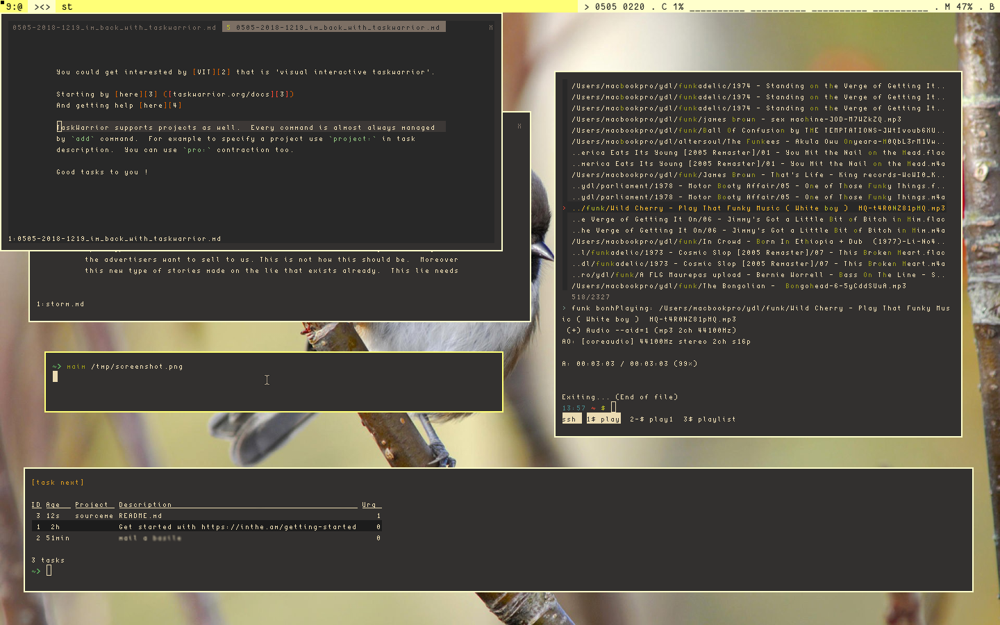
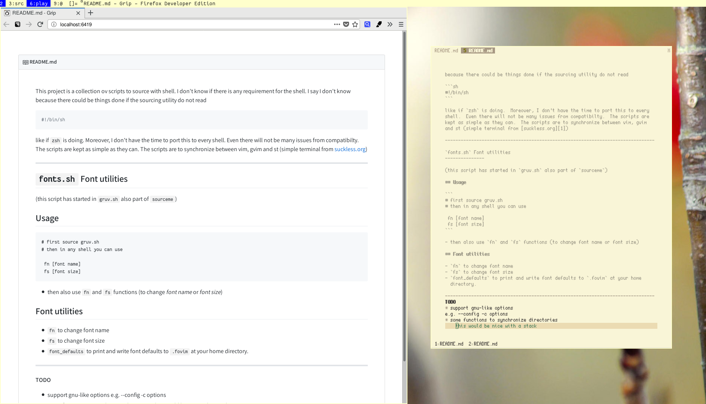

[1]: https://st.suckless.org
[2]: https://github.com/malikbenkirane/screen.sh
[3]: https://github.com/spf13/spf13-vim
[4]: https://github.com/neeasade/xst
[5]: https://github.com/sorin-ionescu/prezto
[6]: https://github.com/malikbenkirane/dwm-fork
[7]: https://github.com/malikbenkirane/gruvbox-contrib/tree/master/st/scripts

# About this

This is a script collection to source with any shell.
I don't know yet if there is any requirement for the shell.
Personally I'm using `zsh` tweaked with the [`zprezto` base][5].

- Even I'm almost certain not to face many compatibility issues.  I don't have the time to port this to every shell.
- The scripts should be kept as simple as possible.
- The scripts are to export/share/synchronize presets between vim, gvim and st (the simple terminal from [suckless.org][1]) or to do anything to make great feeling work environment.

All the scripts are made available from `init.zsh`.  This latter sources them.
But this latter requires the zsh shell.  Althoug this COULD be done, there is
no sh version to initialize the scripts written yet.  I did'nt wrote compatible
version in first place because scripting with zsh was less verbose.
And by the way, I like `zsh` so you can take it and test it (I would recommend
`zprezto` base because it feels good to start like this).

I took some screenshots to show how this looks like.




I may could have written this in any other languages but `source` was my first
aspiration and I kept doing this.

--------------------------------------------------------------------------------

What is this ?  Get Started
---------------------------

This is a package of scripts sourced by `init.zsh`.  I started using these
scripts to be able to switch from one colorscheme to another.  Then I added
fonts utilities (migrated here from the gruv.sh contribution not pulled yet but
here too).  But then things are stacking and gives me a nice set of simple
commands to work with.

I put the scripts in `.sourceme` directory and in my shell rc file, I put the
line

```sh

source $HOME/.sourceme/init.zsh

```

somewhere (now zsh is the only option, but you can try some workaround here).

`init.zsh` is the entry point and is where to select wether scripts to source.
Scipts contains functions that will wrap commands e.g. see [screen.sh][2] simple utility.

But I have made automoations for font utilities and colorschemes that made my flow simpler.

_The environment_ _(I wish I work with and I like to work with)_

suck              | less
---               | ---
window manager    | dwm ([my][6] fork)
terminal emulator | st ([xst][4] fork)
editor/viewer     | vim (base from [spf13vim][3])
shell             | zsh + sourceme + [zprezto][5]

Which scripts ?
---------------

- `fixkeys.sh`: _both shifts to lock caps, ctrl to escape_
- `fonts.sh`: _`fn` and `fs` functions_
- `gruv.sh`: _`gruv` function to manage gruvbox ([go to here][7])_
- `hamster.sh`: _`hamster-cli` aliases_
- `init.zsh`: _sourceme first_
- [`screen.sh`: (_go to here_)][2]
- `seoul.sh`: _`seoul` function to manage seoul256_


--------------------------------------------------------------------------------

`fonts.sh` Font utilities
-------------------------

(this script has started in `gruv.sh` also part of `sourceme`)

## Usage

```
# first source gruv.sh
# then in any shell you can use

 fn [font name]
 fs [font size]
```

- then also use `fn` and `fs` functions (to change _font name_ or _font size_)

## Font utilities

- `fn` to change font name
- `fs` to change font size
- `font_defaults` to print and write font defaults to `.fovim` at your home
  directory.

--------------------------------------------------------------------------------
```
__TODO__
* support gnu-like options
e.g. --config -c options
* do functions to synchronize directories
    this would be nice with a stack
* say more on the utilities (in other words document)
```
